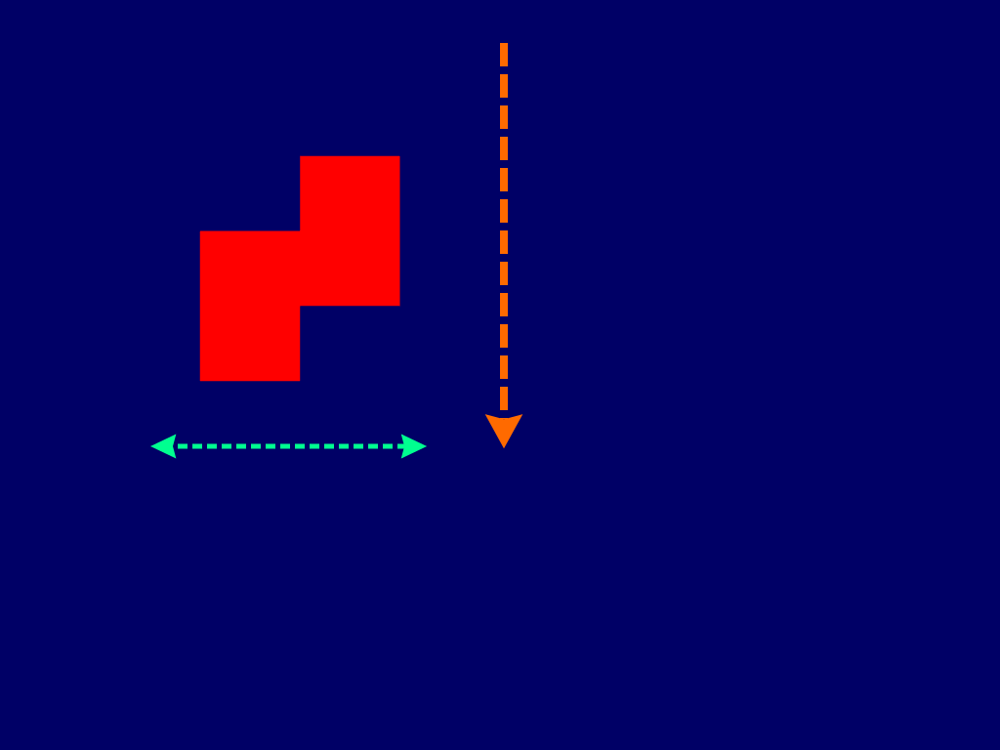
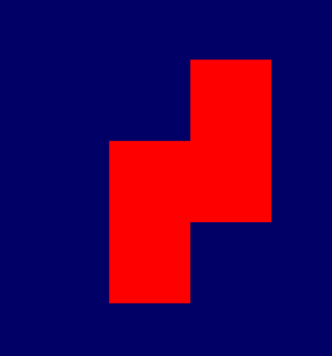
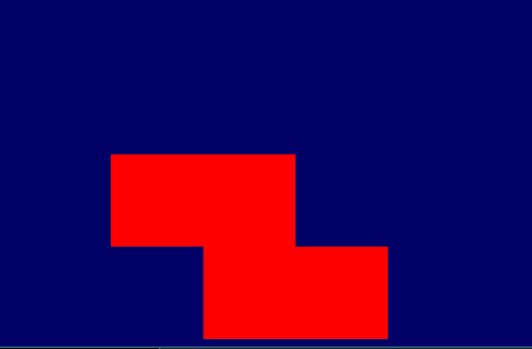
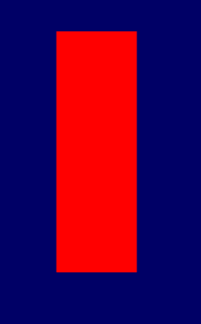
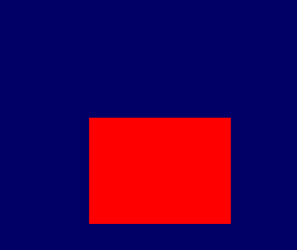
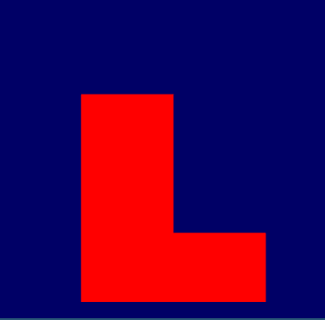

Show case 1 by Christian Bauer
==============================
# My attempt at Tetris

## Screenshots
### Falling Model
 

### Rotating Model
 


### Random model
 



## Description
### Goal

Generate Tetris models which *fall* to the *ground* and control rotation and left-right movement and fall-rate via keyboard input. After Tetris model hits the ground draw the next at the *Ceiling*.
**Difference to Tetris / Failed objectives:**
The fallen models disappears after it hits the ground after which the next model is generated, alternatively the generation could be stopped and the fallen model persist.
No collision detection (other than "hitting the ground) is done.

### Explanation
Generates a randomly picked tetris model with each model consisting of 4 blocks.
Starts drawing the current model at the top of the screen and have it fall towards the bottom of the screen like its being affected by a *gravity* (though no acceleration is affected) -> orange arrow.
Keyboard input (`A`, `S`, and `D`) can affect the models horizontal (i.e. green arrow) and vertical movement, aside from the normal gravity affect, by moving towards left or right or increase fall-effect by holding `S` for "down". a 45 degree rotation is applied each time `Enter` is hit.
The models are generated from squares on-the-fly and could be enhanced via a more complicated model or texture

## Code

Based on [https://github.com/Alfred-Franz/OpenGL-Template](OpenGL-Template)

### Draw models

Function to draw squares..
- via 2 triangles each square,
- diameter 0.1 by default
- offset to draw further squares in same model

Example from code to generate an array of vertices for a rectangle (shorted):
```c++
bool genSquare(glm::vec3* vertices, const int size, const glm::vec3& myT){
    //...
    vertices[0] = glm::vec3(-0.01f, -0.01f, 0.0f) + myT; // shared
    vertices[1] = glm::vec3(-0.01f, 0.01f, 0.0f) + myT; // top left vertex
    vertices[2] = glm::vec3(0.01f, 0.01f, 0.0f) + myT; // shared
    vertices[3] = glm::vec3(-0.01f, -0.01f, 0.0f) + myT;
    vertices[4] = glm::vec3(0.01f, -0.01f, 0.0f) + myT; // bottom right vertex
    vertices[5] = glm::vec3(0.01f, 0.01f, 0.0f) + myT;
    //...
}
for(int i = 0; i < 4; i++){
    genSquare(modelVertices+6*i, 6, glm::vec3(0.0f, 0.2f*i, 0.0f));
}
```

### Handling input

To...
- Move models left/right/down
- Otherwise Y-coordinate gets decremented each frame (model "falls" down)
- Rotate model by 90 degree

Example from code for `key_callback` function to handle input
```c++
void key_callback(GLFWwindow* window, int key, int scancode, int action, int mods)
{
  if (key == GLFW_KEY_ENTER && action == GLFW_PRESS){
    curr_rotation += 1;
  }
   else if (key == GLFW_KEY_S && action == GLFW_PRESS){
    curr_y -= 0.02f;
   }
  else if (key == GLFW_KEY_A && action == GLFW_PRESS){
    curr_x -= 0.02f;
  }
  else if (key == GLFW_KEY_D && action == GLFW_PRESS){
    curr_x += 0.02f;
  }
}
```

### draw multiple objects (attempt)

If model exceeds lower bound:
1. Save vertices of current model
2. Reset Y coordinate
3. Add saved models vertices to _draw buffer_ additionally to current (movable) model

```c++
  // fill Matrix with vertices
  GLfloat g_vertex_buffer_data[num_coordinates*6*num_ModelElements*(models_index+1)]; //create buffer with space for all models
  for(int h = 0; h <= models_index; h++){ // iterate over models
    for(int i = 0; i < model_size; i++){ // iterate over vertices
      for(int j = 0; j < num_coordinates; j++) { // iterate over coordinates in each vertex
        g_vertex_buffer_data[h*num_coordinates*model_size+i*num_coordinates+j] = models[h*num_coordinates*model_size+i*num_coordinates][j];
      }
    }
  }
  for(int i = 0; i < model_size; i++){ // iterate over vertices
    for(int j = 0; j < num_coordinates; j++) { // iterate over coordinates in each vertex
      g_vertex_buffer_data[models_index*model_size*num_coordinates+i*num_coordinates+j] = modelVertices[i][j];
    }
  }
  if (curr_y < -1.0f+half_width){
    curr_y = 1.0f;
    handleModelTouchingGround(modelVertices, model_size);
    model_index = dist6(rng); //select next random model to display
    for(int i = 0; i < model_size; i++){ // save last models vertices in a free slot in models array
      models[models_index*model_size+i] = modelVertices[i];
    }
    models_index++; // increment saved models pointer
  }
  ```