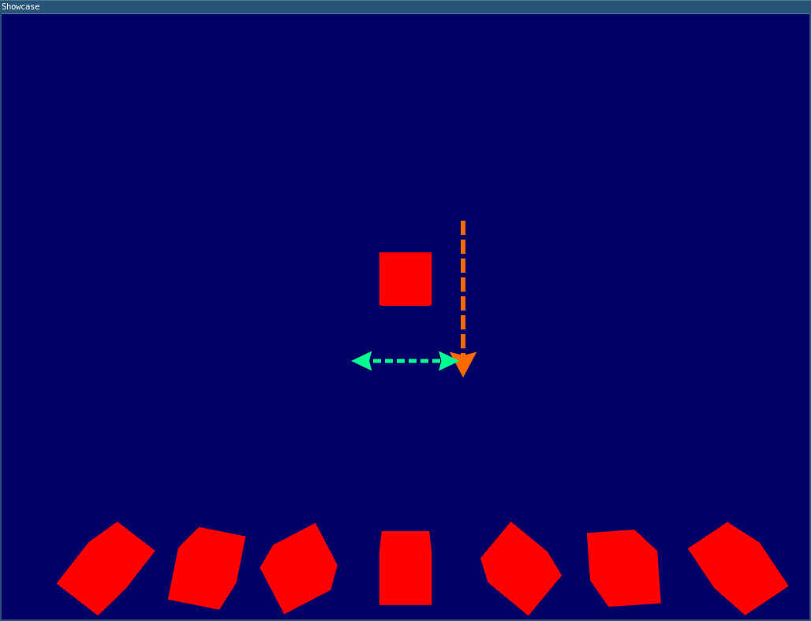

Show case 2 by Christian Bauer
==============================

# Raining Qubes

## Screenshots


## Description
### Goal

Generate 3D **qubes** which *fall* to the *ground* and control rotation and left-right movement and fall-rate via keyboard input, similar to previous Show case. After model hits the ground draw the next at the *Ceiling*.
**Differences:**
- The fallen qube **persists** at the bottom after it hits the ground after which the next qube is generated.
- rotation factor and movement is *smooth*, e.g. rotation isn't fixed at 45 degree steps
- Rotation and offset of fallen qubes is Remembered

### Explanation
Generates 3D qubes (with 6 sides), though the edges aren't visible because of no advanced lighting model/shading.
Starts drawing the *active* (movable) qube at the top of the screen and have it fall towards the bottom of the screen like its being affected by a *gravity* (though no acceleration is affected) -> orange arrow.
Keyboard input (`A`, `S`, `D` and `W`) can affect the models vertical and horizontal movement (i.e. green arrow), aside from the normal gravity affect and have the qube rotate around the z axis by pressing or holding `R`.
The code as is uses fixed arrays of a length of 100, therefore a maximum of 100 models which persist at the *ground* could be drawn, with their **corresponding rotation and horizontal offset** from center could be drawn.

## Code

Based on [https://github.com/Alfred-Franz/OpenGL-Template](OpenGL-Template)
With patch from `10_OpenGL-MovingObjectsWithDifferentTransformations` in Moodle.
Including:
```c++
initializeMVPTransformation()
initializeVertexbuffer()
cleanupVertexbuffer()
```

Drawing models is similar to Showcase 1 with in-code embedded coordinates but vertices being put into a *vector* (array of variable length) of vec3's.


### Drawing multiple objects (draw loop)

Only the vertices of a single qube (at origin) is saved in a VBO and therefore stored on the GPU
Offset and rotation is applied via matrizes.

**If model exceeds lower bound:**
1. Save vertices rotation and offset of current qube
2. Reset variables
3. Increment model_index (holds number of persisting qubes)

```c++
// Save rotation and offset for each "fallen" cube
savedModelsOffset[model_index] = curr_x;
savedModelsRotation[model_index] = curr_angle_z;
// Reset variables
curr_y = UPPER_BOUND;
curr_x = 0;
curr_angle_z = 0;
cleanupVertexbuffer();
initializeVertexbuffer();

// Check overflow
model_index++;
if (model_index > SAVEDMODELSMAX){
    exit(1); // exit because too many models saved
}
```

**for each "saved" cube (depending on model_index) **
```c++
// Recall and set rotation
Rotation = glm::mat4(1.0f);
Rotation = glm::rotate(Rotation, savedModelsRotation[i], glm::vec3(0.0f, 0.0f, 1.0f));

// Recall and set offset
transformation = glm::mat4(1.0f);
transformation = glm::translate(transformation, glm::vec3(savedModelsOffset[i], LOWER_BOUND, 0.0f));

// Apply MVP
initializeMVPTransformation();
MVP = MVP * transformation * Rotation;
glUniformMatrix4fv(MatrixID, 1, GL_FALSE, &MVP[0][0]);
// Draw cube 
glDrawArrays(GL_TRIANGLES, 0, NUM_VERTICES_PER_MODEL);
```