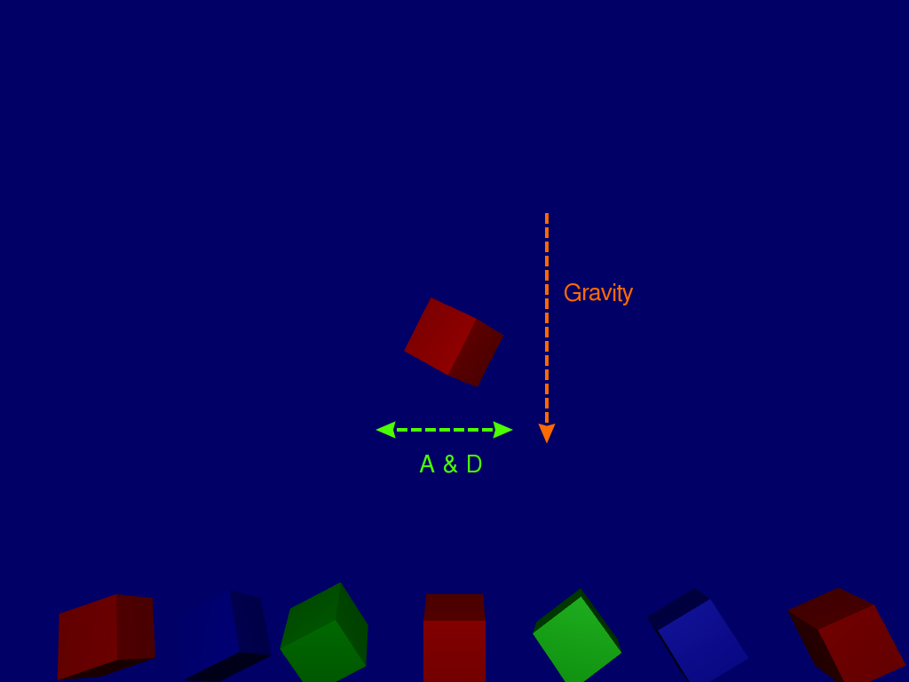

Show case 3 by Christian Bauer
==============================

# Raining Qubes with lighting

## Screenshots


## Description
### Goal

Generate 3D **qubes** which *fall* to the *ground* and control rotation, movement via keyboard input, similar to previous Show case. After model hits the ground draw the next at the *Ceiling*.
**Differences:**
- Dynamic color is set
- Lighting Shader is added for a *real* 3D effect
- Add rotation around Z Axis


### Explanation
Generates 3D qubes, with a 3D effect using a lighting model/shading with ambient, diffuse and specular lighting (Phong model) calculated on the GPU.
Starts drawing the *active* (movable) qube at the top of the screen and have it fall towards the bottom of the screen like its being affected by a *gravity* (though no acceleration is affected) -> orange arrow.
Keyboard input (`A`, `S`, `D` and `W`) can affect the models vertical and horizontal movement (i.e. green arrow), aside from the normal gravity affect and have the qube rotate around the z axis by pressing or holding `R` and around Y Axis to show-case dynamic lighing model.
The code as is uses fixed arrays of a length of 100, therefore a maximum of 100 models which persist at the *ground* could be drawn, with their **corresponding rotation (Y and Z), horizontal offset and color** from center.

## Code

Based on [https://github.com/Alfred-Franz/OpenGL-Template](OpenGL-Template)
With shader code from [OpenGL Tutorial 8 : Basic shading](https://github.com/opengl-tutorials/ogl/tree/master/tutorial08_basic_shading)

Including:
- `tutorial08_basic_shading/StandardShading.vertexshader`
- `tutorial08_basic_shading/StandardShading.fragmentshader`

Drawing models is similar to Showcase 2 with in-code embedded coordinates, and **Normals**.


**Setting dynamic color** depending on global color integer, **gradients** could be set because a *Vertex Buffer* is used instead of a `*uniform*.
```diff
   // Fill Color Buffer
   static GLfloat g_color_buffer_data[12*3*3];
   for (int v = 0; v < NUM_VERTICES_PER_MODEL ; v++){
-      g_color_buffer_data[3*v+0] = 1; // red
-      g_color_buffer_data[3*v+1] = 0; // green
-      g_color_buffer_data[3*v+2] = 0; // blue
+    switch (color){
+      case 0:
+        g_color_buffer_data[3*v+0] = 1; // red
+        g_color_buffer_data[3*v+1] = 0; // green
+        g_color_buffer_data[3*v+2] = 0; // blue
+        break;
+      case 1:
+        g_color_buffer_data[3*v+0] = 0; // red
+        g_color_buffer_data[3*v+1] = 1; // green
+        g_color_buffer_data[3*v+2] = 0; // blue
+        break;
...
+    }
   }
   glGenBuffers(1, &colorbuffer);
   glBindBuffer(GL_ARRAY_BUFFER, colorbuffer);
   glBufferData(GL_ARRAY_BUFFER, sizeof(g_color_buffer_data), g_color_buffer_data, GL_STATIC_DRAW);
   glEnableVertexAttribArray(1);
   glVertexAttribPointer(1, 3, GL_FLOAT, GL_FALSE, 0, (void*)0);
 }
```

**Setting normals** is done manually embedded in code:
```diff
-void genModels(std::vector<glm::vec3> * vertices)
+void genModels(std::vector<glm::vec3> * vertices, std::vector<glm::vec3> * normals)
 {
+  genQube(vertices);
+
+  // front side
+  for(int i = 0; i < NUM_VERTICES_PER_SIDE; i++){
+    normals->push_back(glm::vec3( 0.0f, 0.0f,-1.0f));
+  }
+  // back side
+  for(int i = 0; i < NUM_VERTICES_PER_SIDE; i++){
+    normals->push_back(glm::vec3( 0.0f, 0.0f, 1.0f));
+  }
+  // right sice
+  for(int i = 0; i < NUM_VERTICES_PER_SIDE; i++){
+    normals->push_back(glm::vec3( 1.0f, 0.0f, 0.0f));
+  }
+  // top side
+  for(int i = 0; i < NUM_VERTICES_PER_SIDE; i++){
+    normals->push_back(glm::vec3( 0.0f,-1.0f, 0.0f));
+  }
+  // right sice
+  for(int i = 0; i < NUM_VERTICES_PER_SIDE; i++){
+    normals->push_back(glm::vec3(-1.0f,-1.0f, 0.0f));
+  }
+  // bottom side
+  for(int i = 0; i < NUM_VERTICES_PER_SIDE; i++){
+    normals->push_back(glm::vec3( 0.0f, 1.0f, 0.0f));
+  }
```

**New Uniforms and Buffer** have been added to be send and used in shaders in lighting models:
+  MatrixID = glGetUniformLocation(programID, "MVP");
+  GLuint MatrixVID = glGetUniformLocation(programID, "V");
+  GLuint MatrixMID = glGetUniformLocation(programID, "M");
+  glUniformMatrix4fv(MatrixVID, 1, GL_FALSE, &View[0][0]);
+  glUniformMatrix4fv(MatrixMID, 1, GL_FALSE, &Model[0][0])

Vertex Shader, which computes relevant coordinates and vectors like "Distance to the light" and passes them to fragment shader:
```diff
diff --git a/playground/SimpleVertexShader.vertexshader b/playground/SimpleVertexShader.vertexshader
index 24a83c6..cb32212 100644
--- a/playground/SimpleVertexShader.vertexshader
+++ b/playground/SimpleVertexShader.vertexshader
@@ -3,13 +3,23 @@
 // Input vertex data, different for all executions of this shader.
 layout(location = 0) in vec3 vertexPosition_modelspace;
 // Notice that the "1" here equals the "1" in glVertexAttribPointer
-layout(location = 1) in vec3 vertexColor;
 out vec3 fragmentColor;
+layout(location = 1) in vec3 vertexColor;
+layout(location = 2) in vec3 vertexNormal_modelspace;
+
+// Output data ; will be interpolated for each fragment.
+out vec3 Position_worldspace;
+out vec3 Normal_cameraspace;
+out vec3 EyeDirection_cameraspace;
+out vec3 LightDirection_cameraspace;
 
 // Values that stay constant for the whole mesh.
 uniform mat4 MVP;
+uniform mat4 V;
+uniform mat4 M;
 
 void main(){
+       vec3 LightPosition_worldspace = vec3(0,0,-10);
 
        // Output position of the vertex, in clip space : MVP * position
        gl_Position =  MVP * vec4(vertexPosition_modelspace,1);
@@ -17,5 +27,19 @@ void main(){
     // to produce the color of each fragment
     fragmentColor = vertexColor;
     
+    // Position of the vertex, in worldspace : M * position
+       Position_worldspace = (MVP * vec4(vertexPosition_modelspace,1)).xyz;
+       
+    // Vector that goes from the vertex to the camera, in camera space.
+       // In camera space, the camera is at the origin (0,0,0).
+       vec3 vertexPosition_cameraspace = ( MVP * vec4(vertexPosition_modelspace,1)).xyz; //MPV separation?
+       EyeDirection_cameraspace = vec3(0,0,0) - vertexPosition_cameraspace;
+
+       // Vector that goes from the vertex to the light, in camera space. M is ommited because it's identity.
+       vec3 LightPosition_cameraspace = ( V * vec4(LightPosition_worldspace,1)).xyz; //MPV separation?
+       LightDirection_cameraspace = LightPosition_cameraspace + EyeDirection_cameraspace;
+       
+       // Normal of the the vertex, in camera space
+       Normal_cameraspace = ( MVP * vec4(vertexNormal_modelspace,0)).xyz; // Only correct if ModelMatrix does not scale the model ! Use its inverse transpose if not.
}
```

Fragmentshader:
```diff
diff --git a/playground/SimpleFragmentShader.fragmentshader b/playground/SimpleFragmentShader.fragmentshader
index 8bc214d..3266897 100644
--- a/playground/SimpleFragmentShader.fragmentshader
+++ b/playground/SimpleFragmentShader.fragmentshader
@@ -5,10 +5,53 @@ out vec3 color;
 // Interpolated values from the vertex shaders
 in vec3 fragmentColor;
 
+in vec3 Position_worldspace;
+in vec3 Normal_cameraspace;
+in vec3 EyeDirection_cameraspace;
+in vec3 LightDirection_cameraspace;
+
 void main()
 {
        // White light source fix and at a minimum distance of 9 units to model in direction of camera
+       vec3 LightPosition_worldspace = vec3(0,0,-10);
+       vec3 LightColor = vec3(1,1,1);
+       float LightPower = 500.0f;
+
        // GenericMaterial properties
+       vec3 MaterialDiffuseColor = fragmentColor;
        // Ambient color
+       vec3 MaterialAmbientColor = vec3(0.1,0.1,0.1) * MaterialDiffuseColor;
+       vec3 MaterialSpecularColor = vec3(0.3,0.3,0.3);
+
+       // Distance to the light
+       float distance = length( LightPosition_worldspace - Position_worldspace );
 
-    // Output color = color specified in the vertex shader,
-    // interpolated between all 3 surrounding vertices
-    color = fragmentColor;
+       // Normal of the computed fragment, in camera space
+       vec3 n = normalize( Normal_cameraspace );
+       // Direction of the light (from the fragment to the light)
+       vec3 l = normalize( LightDirection_cameraspace );
+       // Cosine of the angle between the normal and the light direction, 
+       // clamped above 0
+       //  - light is at the vertical of the triangle -> 1
+       //  - light is perpendicular to the triangle -> 0
+       //  - light is behind the triangle -> 0
+       float cosTheta = clamp( dot( n,l ), 0,1 );
+       
+       // Eye vector (towards the camera)
+       vec3 E = normalize(EyeDirection_cameraspace);
+       // Direction in which the triangle reflects the light
+       vec3 R = reflect(-l,n);
+       // Cosine of the angle between the Eye vector and the Reflect vector,
+       // clamped to 0
+       //  - Looking into the reflection -> 1
+       //  - Looking elsewhere -> < 1
+       float cosAlpha = clamp( dot( E,R ), 0,1 );
+       
+       color = 
+               // Ambient : simulates indirect lighting
+               MaterialAmbientColor +
+               // Diffuse : "color" of the object
+               MaterialDiffuseColor * LightColor * LightPower * cosTheta / (distance*distance) +
+               // Specular : reflective highlight, like a mirror
+               MaterialSpecularColor * LightColor * LightPower * pow(cosAlpha,5) / (distance*distance);
 }
```